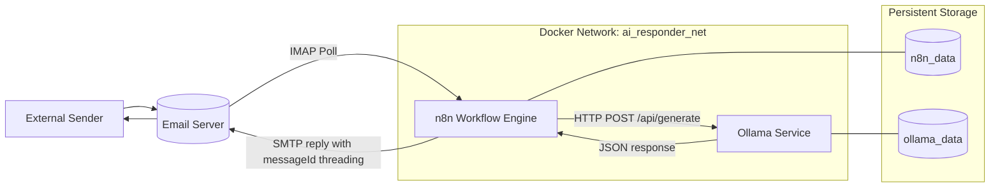
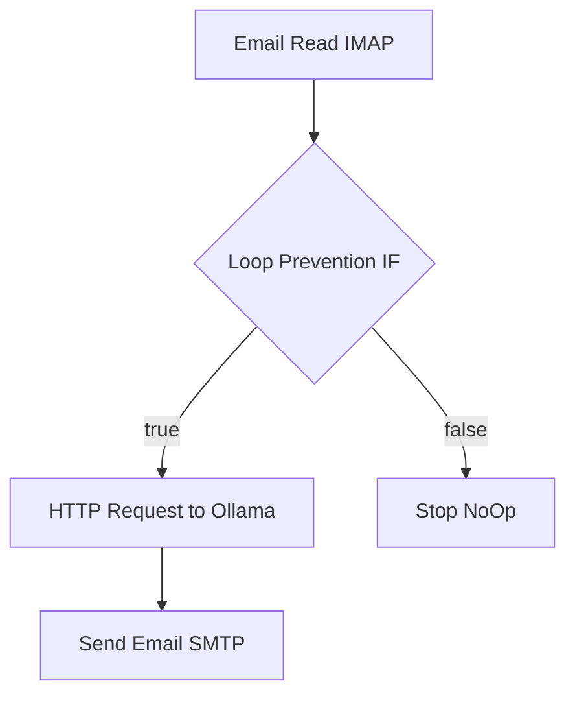
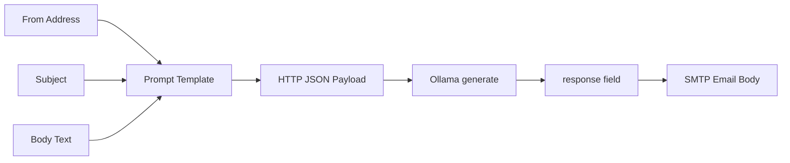
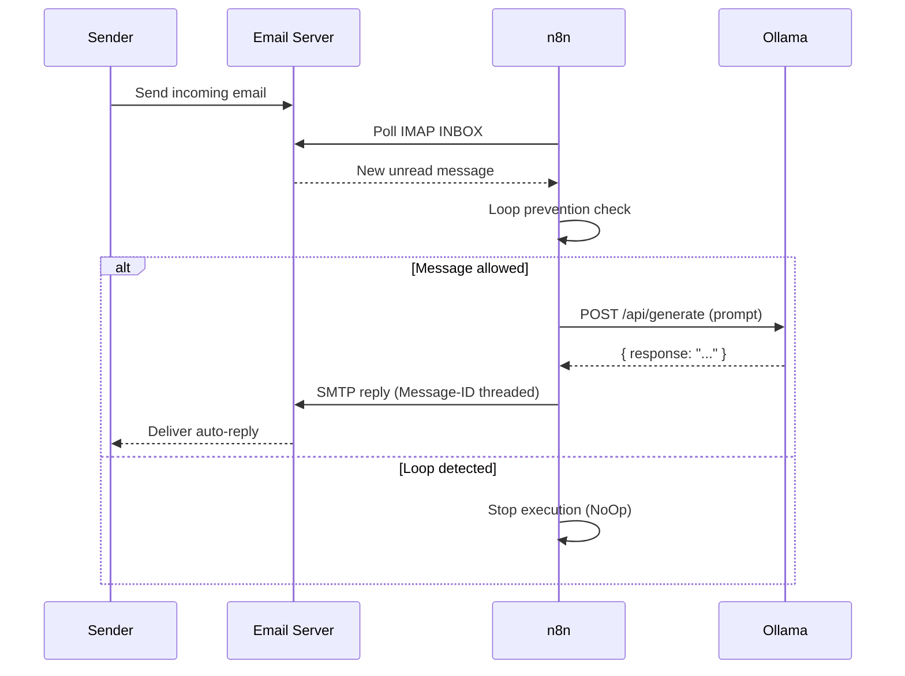

# Local AI Email Auto-Responder


## Project Overview

This project implements a fully local, privacy-first AI email auto-responder using n8n for orchestration and Ollama for on-device LLM inference.

When a new email arrives, the workflow:

1. Reads the email using IMAP.
2. Applies loop-prevention rules.
3. Sends a dynamic prompt to a local model (`llama3:8b`) via Ollama.
4. Sends a threaded reply over SMTP.

No cloud AI API is used for generation. Prompt and response stay on local infrastructure.

## Key Features

- Local inference with Ollama (`llama3:8b`)
- Visual automation using n8n workflow nodes
- Email thread continuity using Message-ID reply mapping
- Loop prevention to avoid self-reply storms
- Dockerized deployment with health checks and persistent volumes
- Clear submission-ready artifacts for evaluation

## Tech Stack

| Layer | Technology | Why It Was Chosen |
|---|---|---|
| Orchestration | n8n | Visual, maintainable automation and strong email node ecosystem |
| LLM Runtime | Ollama | Easy local model hosting with simple HTTP API |
| Model | llama3:8b | Good quality-to-resource tradeoff for email drafting |
| Containerization | Docker + Docker Compose | Reproducible local setup with service networking |
| Protocols | IMAP / SMTP / HTTP | Standard email retrieval, sending, and model invocation |

## Code Structure and Folder Organization

```text
GPP-5/
├── .env                     # Local environment values (not for commit)
├── .env.example             # Required environment variables template
├── .gitignore               # Git exclusions
├── docker-compose.yml       # n8n + Ollama + model init services
├── workflow.json            # Exported n8n workflow
├── workflow_with_id.json    # Workflow variant including explicit workflow id
├── submission.json          # Evaluator credential schema file
├── README.md                # Project overview and usage guide
├── architecture.md          # System architecture and component design
└── projectdocumentation.md  # Full technical documentation
```

## System Architecture



## Workflow Explanation

The workflow in [workflow.json](workflow.json) is intentionally simple and auditable:

1. `Email Read (IMAP)` trigger reads unread messages from INBOX.
2. `Loop Prevention` IF node checks:
   - sender is not the responder address
   - subject does not start with `Re: AI Auto-Reply:`
3. `Generate Reply with Ollama` sends a dynamic prompt including sender, subject, and email body.
4. `Send Reply Email` returns model output to original sender and uses original Message-ID for threading.
5. Loop-detected branch ends in `Stop - Loop Detected` (`NoOp`).

### n8n Node Execution Flow



### Prompt Construction Flow



### Sequence Diagram



## Local Setup and Installation

### Prerequisites

- Docker Desktop (Compose v2)
- Internet access for first model pull
- IMAP + SMTP capable email account

### Step 1: Configure Environment

```powershell
Copy-Item .env.example .env
```

Update `.env` with valid values:

- `IMAP_HOST`, `IMAP_PORT`, `IMAP_USER`, `IMAP_PASS`
- `SMTP_HOST`, `SMTP_PORT`, `SMTP_USER`, `SMTP_PASS`
- `N8N_HOST`, `N8N_PORT`, `N8N_PROTOCOL`, `WEBHOOK_URL`

### Step 2: Start Services

```powershell
docker compose up -d --build
```

### Step 3: Verify Health

```powershell
docker compose ps
docker exec ollama_responder ollama list
Invoke-RestMethod -Uri http://localhost:11434/api/tags -Method Get
Invoke-WebRequest -Uri http://localhost:5678/healthz -UseBasicParsing
```

### Step 4: Import Workflow into n8n

1. Open `http://localhost:5678`
2. Import [workflow.json](workflow.json)
3. Bind IMAP and SMTP credentials in n8n
4. Activate workflow

## Usage Instructions

1. Send an email from a different account to the configured IMAP address.
2. Wait for polling interval (every minute).
3. Open n8n Executions and inspect node outputs.
4. Confirm generated reply is received and threaded in same conversation.
5. Send a self-email to verify loop prevention branch.

## Validation and Testing Strategy

### Functional Checks

- Compose config validity: `docker compose config`
- Container health: `docker compose ps`
- Model presence: `ollama list`
- Ollama generation test: `POST /api/generate` with test prompt
- n8n endpoint: `/healthz` returns 200
- Workflow contract checks:
  - Trigger node type is IMAP
  - HTTP node method is POST to `http://ollama:11434/api/generate`
  - Prompt contains dynamic subject/body references
  - SMTP node sends to original sender
  - Message-ID threading is set
  - IF node routes true path to Ollama

### E2E Validation

Use real credentials in `.env` and [submission.json](submission.json), then validate:

- Incoming email triggers execution
- Ollama returns model text
- SMTP sends threaded reply
- Loop prevention blocks self/reply-chain loops

## Performance and Scalability Notes

- Main bottleneck is model inference latency.
- For higher volume:
  - use smaller/faster models or GPU-backed inference
  - run n8n in queue mode with workers
  - throttle and batch SMTP operations
  - add retry/backoff and dead-letter patterns

## Troubleshooting

### Ollama connection error from n8n

- Ensure URL uses service name, not localhost inside workflow: `http://ollama:11434/api/generate`
- Confirm both services share `ai_responder_net`

### Model not found

```powershell
docker exec -it ollama_responder ollama pull llama3:8b
docker exec ollama_responder ollama list
```

### Email auth failures

- Verify IMAP/SMTP host, port, and auth mode
- Use app password where provider requires it

## Production Readiness Checklist

- [x] Health checks on n8n and Ollama
- [x] Persistent volumes for workflows and models
- [x] Loop prevention implemented
- [x] Threaded replies implemented
- [x] Prompt generated from dynamic email context
- [x] Local-first AI inference
- [ ] Add dedicated n8n error workflow
- [ ] Add retry/backoff in workflow nodes
- [ ] Add observability dashboards and alerts

## Related Documents

- [architecture.md](architecture.md)
- [projectdocumentation.md](projectdocumentation.md)
