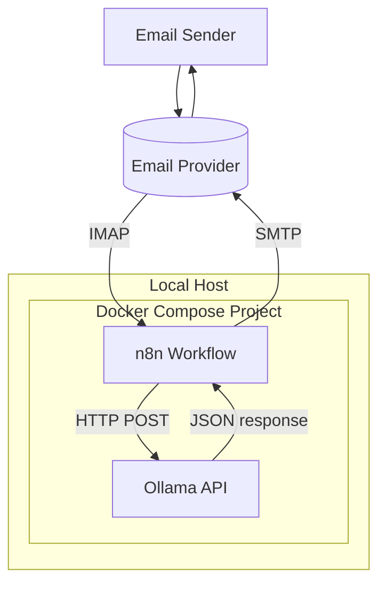
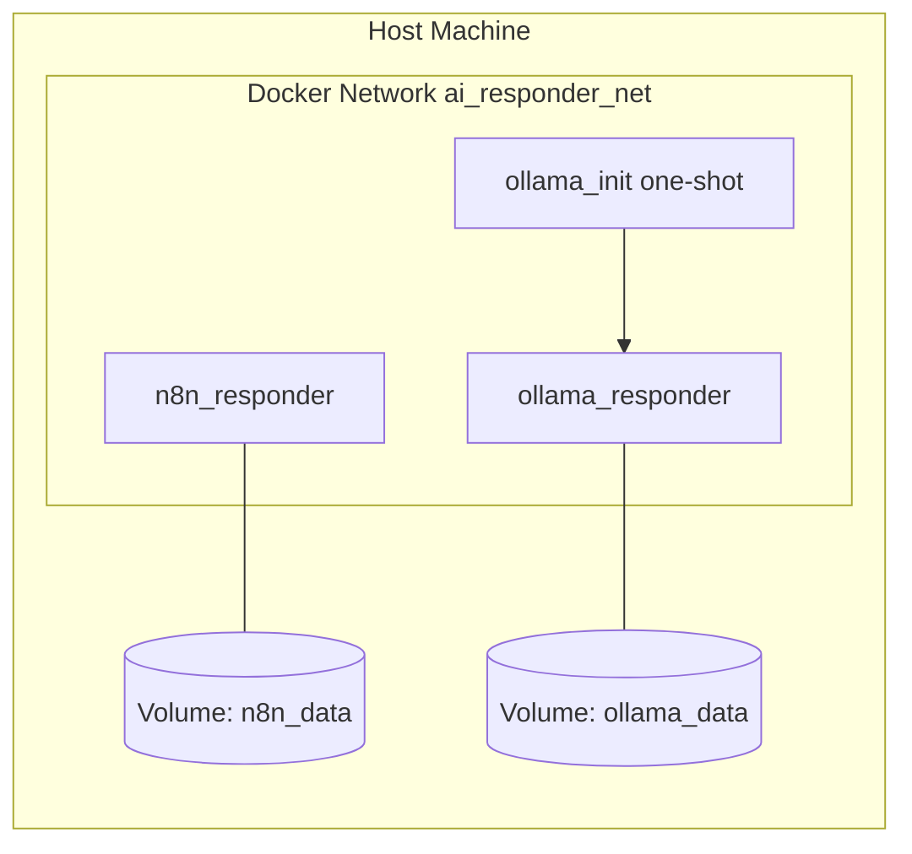
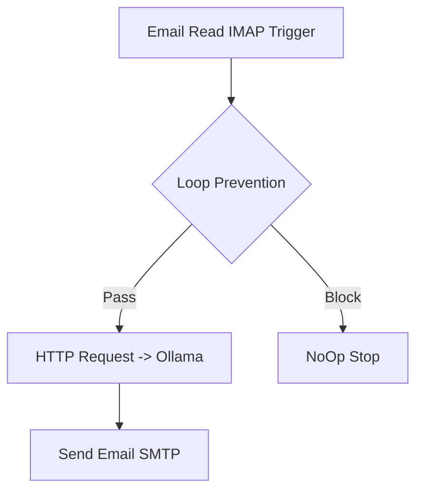
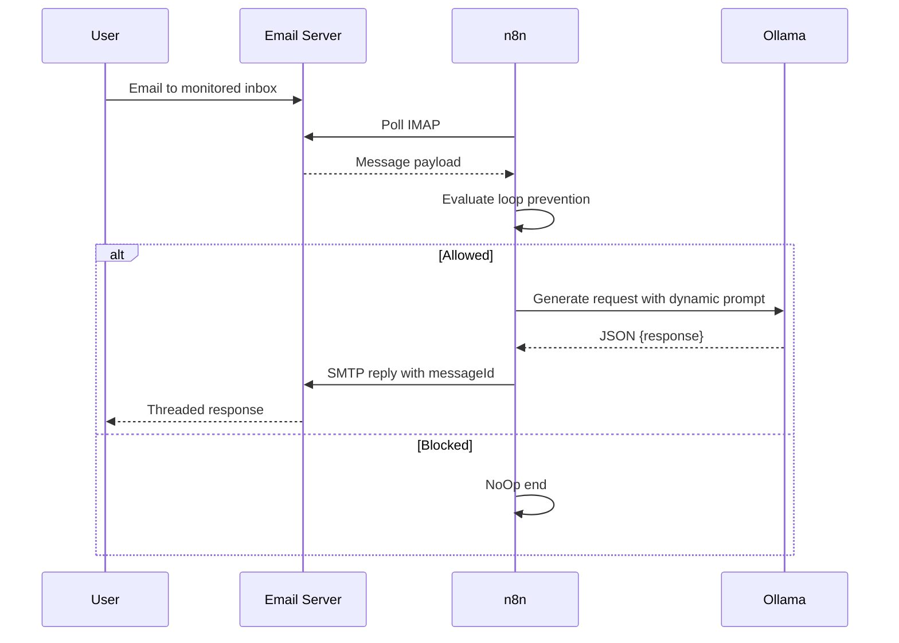

# Architecture Document

## 1. Main Idea and Objective

The system is designed to provide automated, context-aware email replies with local AI inference.

Primary objective:

- Build a private and reproducible auto-responder that reads emails via IMAP, generates replies through a local LLM (Ollama), and sends threaded responses via SMTP.

Secondary objectives:

- Avoid cloud AI dependency for inference.
- Keep architecture simple, inspectable, and easy to operate.
- Preserve conversation context using Message-ID threading.

## 2. High-Level Architecture

## 3. Deployment Architecture

## 4. Service Design

### n8n Service

- Image: `n8nio/n8n:latest`
- Responsibility: Workflow execution, IMAP polling, HTTP call orchestration, SMTP send.
- Persistence: `n8n_data:/home/node/.n8n`
- Health endpoint: `/healthz`

### Ollama Service

- Image: `ollama/ollama:latest`
- Responsibility: Host and execute local model inference (`llama3:8b`).
- Persistence: `ollama_data:/root/.ollama`
- API: `http://ollama:11434/api/generate`

### ollama-init Service

- One-shot bootstrap utility.
- Waits for Ollama health and executes `ollama pull llama3:8b`.
- Ensures model availability after compose startup.

## 5. Workflow Architecture

### Node Responsibilities

1. Email Read IMAP
   - Polls INBOX every minute.
   - Reads sender, subject, body, message id.

2. Loop Prevention IF
   - Condition A: sender != SMTP sender identity.
   - Condition B: subject not prefixed with auto-reply marker.
   - Prevents recursive reply loops.

3. HTTP Request to Ollama
   - Sends JSON body with `model`, `stream`, and dynamic `prompt`.
   - Uses `stream=false` for simple parsing.

4. Send Email SMTP
   - Recipient is original sender.
   - Body maps to Ollama `response` field.
   - Threading uses original `messageId`.

5. NoOp
   - Explicit terminal branch for blocked messages.

## 6. Data Flow and Execution Flow

## 7. Integration Details

### IMAP Integration

- Trigger-based polling node in n8n.
- Reads unread messages from target mailbox.

### Ollama Integration

- Direct service-name call over Docker network.
- Request URL: `http://ollama:11434/api/generate`.
- Response format consumed as JSON.

### SMTP Integration

- Sends AI-generated body text to original sender.
- Uses Message-ID in options for proper conversation threading.

## 8. Problem-Solving Approach

Design principles used:

- Local-first AI for privacy and cost control.
- Minimal workflow complexity for reliability.
- Explicit loop prevention before expensive model execution.
- Health checks and startup ordering to reduce runtime race conditions.

## 9. Tech Stack Rationale

| Component | Choice | Rationale |
|---|---|---|
| Automation | n8n | Fast visual workflow implementation and maintainability |
| Local LLM runtime | Ollama | Operationally simple local model hosting |
| Model | llama3:8b | Better quality than mini models for email responses |
| Runtime packaging | Docker Compose | Repeatable local deployment with clear service boundaries |

## 10. Advantages and Trade-Offs

### Advantages

- Private inference path for email content.
- No per-token cloud billing.
- Clear and auditable flow in n8n.
- Easy setup via Docker Compose.

### Trade-Offs

- Inference speed limited by local hardware.
- Polling model can add delay up to poll interval.
- Current workflow has limited in-workflow retry/fallback behavior.

## 11. Failure Points and Current Tolerance

Current protections:

- Service health checks.
- `depends_on` with health condition.
- HTTP request timeout in workflow.

Current gaps for production hardening:

- No dedicated error workflow.
- No exponential backoff retry path in n8n flow.
- No central alerting on repeated failures.

## 12. Scalability Considerations

Potential bottlenecks:

1. Ollama inference throughput.
2. n8n execution concurrency.
3. SMTP/IMAP provider rate limits.

Recommended upgrades:

- Queue-based n8n execution with workers.
- Smaller/faster model for default path and route complex cases to larger model.
- Add throttling and retry queues for outbound email.
- Add metrics and alerting around node failures and latency.

## 13. Security and Privacy Notes

- AI inference data remains local to Docker network and host.
- Credentials are externalized via environment variables.
- Persistent volumes keep operational state local.
- Email transport still depends on external provider infrastructure.
