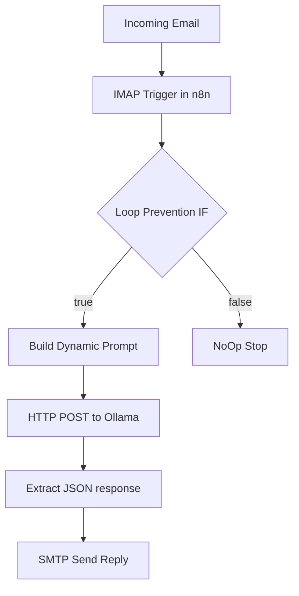
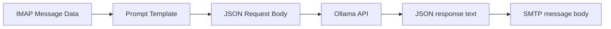

# Project Documentation

## 1. Project Summary

This project delivers a local AI-powered email responder that combines:

- n8n workflow automation
- Ollama local model inference
- IMAP/SMTP integration

Goal:

- Automatically generate and send context-aware replies while preserving privacy through local inference.

## 2. Scope and Functional Requirements Mapping

Implemented capabilities:

1. Docker Compose stack with `n8n` and `ollama` services.
2. Model availability (`llama3:8b`) through one-shot init service.
3. Exported workflow JSON containing nodes and connections.
4. IMAP trigger for new emails.
5. HTTP POST to local Ollama endpoint.
6. Prompt constructed dynamically from incoming email data.
7. Response parsing from `response` field.
8. SMTP send to original sender.
9. Thread continuity via Message-ID reply mapping.
10. Loop prevention using sender and subject checks.
11. `.env.example` for required environment documentation.
12. `submission.json` for evaluator credential schema.

## 3. Detailed System Design



## 4. Module Breakdown and Responsibilities

### 4.1 Infrastructure Module

Files:

- [docker-compose.yml](docker-compose.yml)
- [.env.example](.env.example)

Responsibilities:

- Define containers, network, and persistent storage.
- Ensure service health and startup sequence.
- Keep configuration externalized and reusable.

### 4.2 Workflow Module

File:

- [workflow.json](workflow.json)

Responsibilities:

- Ingest incoming email events.
- Apply loop prevention.
- Build inference prompt.
- Request local generation.
- Send threaded response.

### 4.3 Submission and Evaluation Module

File:

- [submission.json](submission.json)

Responsibilities:

- Provide evaluator-readable IMAP/SMTP credentials schema.

## 5. Data Flow Specification



Primary fields used across flow:

- `from.address`
- `subject`
- `text`
- `messageId`
- `response`

## 6. Execution Flow and Control Logic

Control conditions:

- Continue only if sender is not equal to configured SMTP user.
- Continue only if subject does not start with auto-reply prefix.

Branching behavior:

- True branch: model generation + send email.
- False branch: terminate with NoOp.

## 7. Prompt Engineering Details

Prompt strategy:

- Assign assistant role and tone.
- Inject sender, subject, and body dynamically.
- Constrain output format to plain reply content.

Expected quality impact:

- Better relevance by grounding prompt in current email context.
- Less verbosity by explicit output-format constraints.

## 8. Integration and Interface Contracts

### Ollama API Contract

Endpoint:

- `POST /api/generate`

Request fields:

- `model`: `llama3:8b`
- `stream`: `false`
- `prompt`: composed string with dynamic expressions

Response fields:

- `response`: generated text body

### SMTP Contract

Required send parameters:

- recipient from original sender
- subject with reply prefix
- text from Ollama response
- messageId for threading

## 9. Setup and Installation

### 9.1 Environment Setup

```powershell
Copy-Item .env.example .env
```

Populate `.env` with valid values for:

- IMAP host/port/user/password
- SMTP host/port/user/password
- n8n host/port/protocol/webhook url

### 9.2 Bring Up Stack

```powershell
docker compose up -d --build
```

### 9.3 Verify Services

```powershell
docker compose ps
docker exec ollama_responder ollama list
Invoke-RestMethod -Uri http://localhost:11434/api/tags -Method Get
Invoke-WebRequest -Uri http://localhost:5678/healthz -UseBasicParsing
```

### 9.4 Activate Workflow

1. Open n8n on `http://localhost:5678`.
2. Import [workflow.json](workflow.json).
3. Configure IMAP and SMTP credentials in n8n UI.
4. Activate workflow.

## 10. Usage Guide

1. Send test email from another account.
2. Observe execution in n8n.
3. Confirm generated threaded reply arrives.
4. Run self-sender loop-prevention test.

## 11. Testing Strategy and Validation Checks

### Unit-Level Validation (Contract-based)

- Validate JSON parsing for workflow and submission artifacts.
- Validate required node types and critical parameters.

### Integration Validation

- Confirm n8n can call Ollama endpoint by service name.
- Confirm SMTP node uses generated response content.
- Confirm message threading with original message id.

### End-to-End Validation

- Real IMAP inbound email triggers response cycle.
- Generated response sent back to sender.
- Conversation thread preserved.

## 12. Problem-Solving Approach

Approach summary:

1. Build deterministic infrastructure first (Compose + health checks).
2. Build linear workflow with explicit safety gate.
3. Use dynamic prompt with constrained output.
4. Validate service health and API behavior before E2E email tests.

## 13. Performance, Stability, and Scalability

Current behavior:

- Stable for low-to-moderate throughput workloads.

Likely bottlenecks:

- LLM inference speed.
- n8n execution throughput under concurrent load.
- Mail provider limits.

Recommended enhancements:

- Worker queue mode in n8n.
- Model tiering (fast model for simple mails).
- Retries with backoff and dead-letter handling.
- Monitoring and alerting.

## 14. Pros and Cons

### Pros

- Local-first privacy for AI inference.
- Cost control by avoiding cloud token billing.
- Easy reproducibility with Docker Compose.
- Clear workflow observability via n8n UI.

### Cons

- Inference quality/speed depends on host hardware.
- Polling introduces delay compared to push/webhook systems.
- Limited failure recovery logic in current workflow.

## 15. Privacy and Security Considerations

- AI inference payloads remain local within Docker network.
- Credentials are parameterized through env variables.
- Volumes persist data on local machine.
- External email provider still handles message transport.

## 16. Production Readiness and Hardening Plan

Immediate hardening tasks:

1. Add dedicated n8n error workflow and alerts.
2. Add retry/backoff around IMAP/SMTP/Ollama operations.
3. Introduce observability stack (logs, metrics, tracing).
4. Add load testing for target email throughput.
5. Add secrets manager integration for credentials.

## 17. Documentation Index

- [README.md](README.md)
- [architecture.md](architecture.md)
- [projectdocumentation.md](projectdocumentation.md)
- [answers.md](answers.md)
